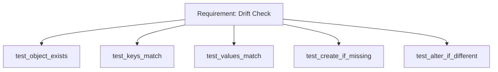

important fields to make sure are present in the definition file:
- object 
- name
- depends_on

```yaml
role: # object
  - name: aws_step_function # object name
    depends_on: # dependecies field, must be present even if left as None
```


for simplicity the file names and the object name in the yaml files must match the snowflake official object name"


# How it works

Snowflake SQL jinja templates are being rendere with the data from the defintions yaml files.
1. Reads the yaml files
2. Builds a topographic map of the snowflake objects defined in the yaml files for sorting the dependecies. 
3. An ordered list of objects (based on the dependecies) is created from the map.
4. Snowflake is being queried (show object/describe object) to the definition of already existing objects
5. The object'y yaml file state is being checked against the object's state in Snowflake. If there is a difference,  
   the iac_action would be to alter an ojbect. If the object does not exists in Snowflake it will be created base on the yaml file. 

You can do a dry-run, that would only print out the plan for execution.

You can use differen roles to create objects, since it will be using an OAuth authentification with ANY ROLE opiton. 


Can't use the query history as it holds info only up to one year https://select.dev/posts/snowflake-query-history


Use SQLAlchemy to establish the connection for oracle and snowflake
https://chatgpt.com/c/6873b4d5-36ac-800d-b8ac-0a62e72f3724

Not using id tags to identify object, this limitation is OK
Also not using different owners for each object, using one more sequire anyway.
These simplify things.
Probably not implementing warehouse size, since it is snowflake specific. 


[Normalize Object Definition](../drift_test.py/#L10) 
<details>
<summary>Click to expand</summary>

```gherkin
  Scenario: Normalize Object Definitions
    Given 
    When
    Then
```
</details>


# Requirement 1: Object Drift Detection

<details>
<summary>Test Cases</summary>

- `test_object_exists`
- `test_keys_match`
- `test_values_match`
- `test_create_if_missing`
- `test_alter_if_different`
</details>



Test coverage:
- `tests/test_drift_check.py::TestDriftCheck::test_no_action_matches`


#### How to establish the connections
You have to load the drivers for each type of database 
You can use pip isntall for snowflake and oracle db
```
pip install snowflake-connector-python
pip install snowflake-sqlalchemy

pip install oracledb
```
Then the connection for snowflake for example will look like the below

```python

import tomllib
import os
import snowflake.sqlalchemy
from sqlalchemy import create_engine, text
from cryptography.hazmat.primitives import serialization
from cryptography.hazmat.backends import default_backend


# --- Snowflake connection params ---
user = "DBT_CLI_SERVICE_ACCOUNT"
account = "bl67109-ajwa_dev"
warehouse = "DBT_CLI_WAREHOUSE"
database = "AJWA_MODEL"
schema = "PBI_AUDIT"
role = "DBT_CLI_ROLE"

private_key_path = ".ssh/dev/snowflake_dbt_cli_key.p8"

# --- Load private key ---
with open(private_key_path, "rb") as key_file:
    p_key = serialization.load_pem_private_key(
        key_file.read(),
        password=None,
        backend=default_backend()
    )

private_key_bytes = p_key.private_bytes(
    encoding=serialization.Encoding.DER,
    format=serialization.PrivateFormat.PKCS8,
    encryption_algorithm=serialization.NoEncryption(),
)

# --- Build SQLAlchemy URL ---
# Note: private_key must be passed directly in the URL parameters.
url = (
    f"snowflake://{user}@{account}/{database}/{schema}"
    f"?warehouse={warehouse}"
    f"&role={role}"
)

engine = create_engine(
    url,
    connect_args={
        "private_key": private_key_bytes
    },
    echo=False
)

# Test
conn = engine.connect()


###################################
# Loading the key from env variable

import os
from cryptography.hazmat.primitives import serialization

pem_key = os.environ["SNOWFLAKE_PRIVATE_KEY"].encode("utf-8")

p_key = serialization.load_pem_private_key(
    pem_key,
    password=None,
)

private_key_bytes = p_key.private_bytes(
    encoding=serialization.Encoding.DER,
    format=serialization.PrivateFormat.PKCS8,
    encryption_algorithm=serialization.NoEncryption(),
)
```
